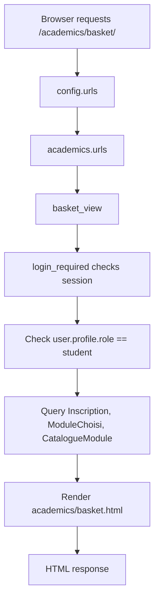
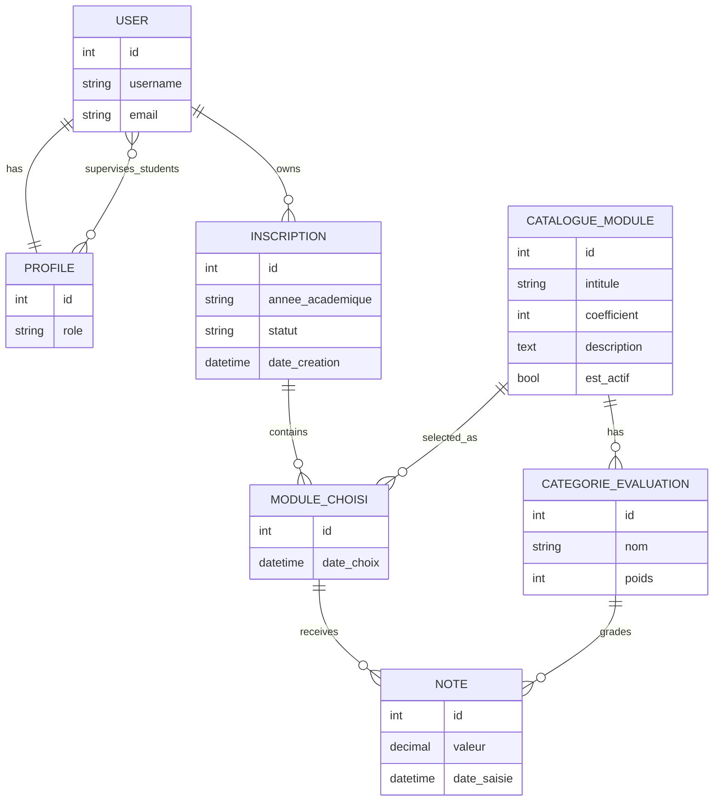
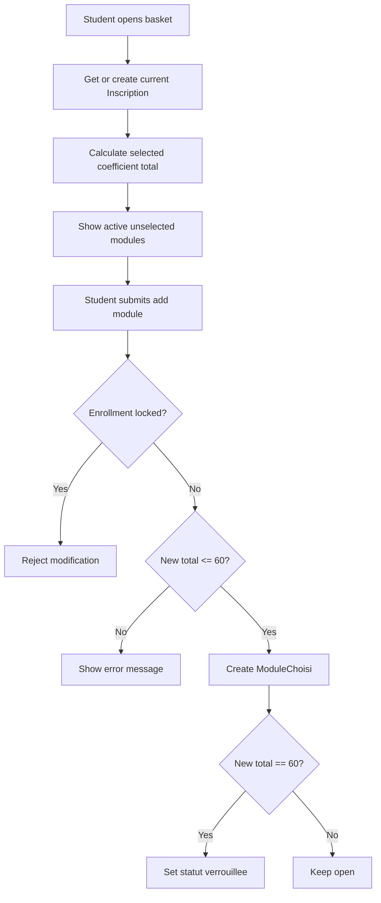
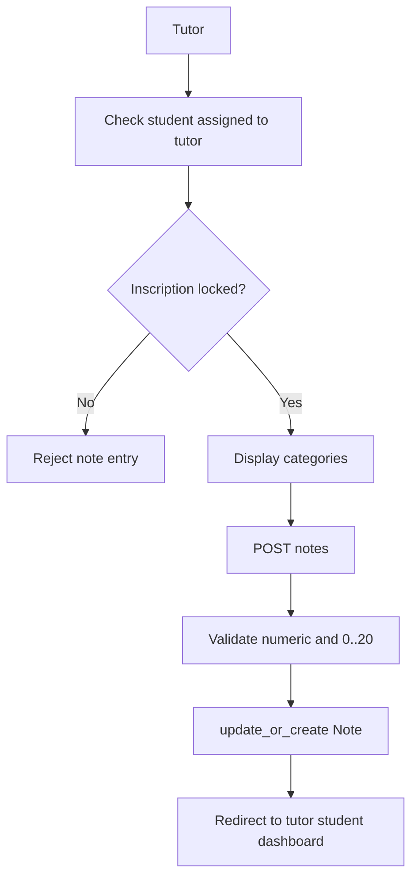

# UniNotes ERP Django Project: Complete Technical Audit and Educational Report

## Table of Contents

1. [Project Overview](#project-overview)
2. [Project Structure Analysis](#project-structure-analysis)
3. [Django Architecture](#django-architecture)
4. [Database and Models Documentation](#database-and-models-documentation)
5. [Authentication and Authorization](#authentication-and-authorization)
6. [Signals](#signals)
7. [Business Logic](#business-logic)
8. [Views Documentation](#views-documentation)
9. [Forms Documentation](#forms-documentation)
10. [Services Layer](#services-layer)
11. [Django ORM Deep Explanation](#django-orm-deep-explanation)
12. [Templates System](#templates-system)
13. [Frontend and CSS](#frontend-and-css)
14. [Chart.js Integration](#chartjs-integration)
15. [Security Architecture](#security-architecture)
16. [Errors Encountered During Development](#errors-encountered-during-development)
17. [Git Workflow](#git-workflow)
18. [Code Quality Review](#code-quality-review)
19. [Scalability Recommendations](#scalability-recommendations)
20. [Oral Defense Preparation](#oral-defense-preparation)
21. [Final Conclusion](#final-conclusion)

## Project Overview

UniNotes ERP is a Django web application for academic enrollment and grade tracking. It models a simplified university ERP where students choose academic modules, tutors supervise assigned students, and administrators manage academic data through Django Admin.

An ERP, or Enterprise Resource Planning system, is software that centralizes business processes. In this project, the business domain is academic management. Instead of managing finance, inventory, or HR, UniNotes ERP manages users, student registrations, module catalogs, evaluation categories, grades, dashboards, and academic progression.

The application demonstrates several important Django concepts:

- Authentication with Django's built-in `User` model.
- Role-based behavior through a custom `Profile` model.
- App separation with `accounts`, `academics`, and `dashboard`.
- Database modeling with relationships, constraints, validators, and model metadata.
- Function-based views protected by `login_required`.
- Template inheritance and reusable UI components.
- Business rules such as the 60-point enrollment limit.
- Service-layer calculations using the Django ORM.
- Chart rendering through Chart.js.

### Main Roles

The project defines two explicit application roles in `accounts.models.Profile`:

- `student`: can register, create an enrollment basket, select modules up to 60 coefficient points, view dashboards, and consult grade evolution.
- `tutor`: can view assigned students and enter or update notes only after a student's enrollment is locked.

The Django admin role is provided by Django's built-in `is_staff` and `is_superuser` flags. Administrators can use `/admin/` to manage modules, evaluation categories, enrollments, chosen modules, notes, and profiles.

### Main Functionalities

- User registration with role selection.
- Login and logout.
- Automatic profile creation through signals.
- Student enrollment basket.
- Active module catalog display.
- 60-point enrollment rule.
- Enrollment locking once the total coefficient reaches 60.
- Tutor assignment through `Profile.students`.
- Tutor-only note management.
- Student dashboard in read-only mode.
- Tutor dashboard reuse for assigned students.
- Weighted module average calculation.
- Weighted general average calculation.
- Historical average calculation for evolution charts.
- Responsive UI using CSS variables, cards, grids, tables, and media queries.

## Project Structure Analysis

The main Django project is located in `uninotes_erp_bahrouni_ayoub`.

```text
uninotes_erp_bahrouni_ayoub/
├── accounts/
│   ├── admin.py
│   ├── apps.py
│   ├── forms.py
│   ├── models.py
│   ├── signals.py
│   ├── urls.py
│   └── views.py
├── academics/
│   ├── admin.py
│   ├── forms.py
│   ├── models.py
│   ├── services.py
│   ├── urls.py
│   └── views.py
├── dashboard/
│   ├── admin.py
│   ├── apps.py
│   ├── models.py
│   ├── urls.py
│   └── views.py
├── config/
│   ├── settings.py
│   ├── urls.py
│   ├── asgi.py
│   └── wsgi.py
├── templates/
│   ├── base.html
│   ├── accounts/
│   ├── academics/
│   ├── core/
│   └── dashboard/
├── static/
│   └── css/style.css
├── db.sqlite3
├── manage.py
└── README.md
```

### `config/`

The `config` package is the Django project package. It contains global configuration.

- `settings.py`: project settings such as installed apps, middleware, templates, database, static files, and authentication redirects.
- `urls.py`: root URL router that includes app-level URL configurations.
- `asgi.py` and `wsgi.py`: deployment entry points.

Important observations from `settings.py`:

- The project uses SQLite for development.
- `DEBUG = True`, which is suitable for local development only.
- `STATICFILES_DIRS = [BASE_DIR / 'static']` enables the project-level `static/` folder.
- `TEMPLATES['DIRS'] = [BASE_DIR / 'templates']` enables shared project-level templates.
- `LOGIN_URL = "login"`, `LOGIN_REDIRECT_URL = "home"`, and `LOGOUT_REDIRECT_URL = "login"` define default auth navigation.
- `accounts.apps.AccountsConfig` is installed, which is important because `AccountsConfig.ready()` loads signals.

### `accounts/`

The `accounts` app handles identity and roles.

- `models.py`: defines `Profile`, which extends Django's built-in `User` model with role and tutor-student assignment.
- `forms.py`: defines `RegisterForm`, extending `UserCreationForm` with email and role.
- `views.py`: registration, custom login behavior, logout behavior.
- `signals.py`: automatically creates a default student profile when a new `User` is created.
- `admin.py`: exposes profiles in the Django admin.
- `urls.py`: routes registration, login, and logout.

### `academics/`

The `academics` app contains the academic domain.

- `models.py`: defines module catalog, evaluation categories, student enrollment, selected modules, and notes.
- `views.py`: handles basket management and tutor note editing.
- `services.py`: contains reusable grade calculation functions.
- `forms.py`: defines `NoteForm`, although current note management uses manual POST parsing.
- `admin.py`: registers all academic models with useful list displays, filters, search fields, and inline category editing.
- `urls.py`: routes basket and notes pages.

### `dashboard/`

The `dashboard` app handles read-only academic presentation.

- `views.py`: home page, student dashboard, evolution chart, tutor student list, tutor view of a student dashboard.
- `urls.py`: dashboard routes.
- `models.py`: currently empty because dashboard data is derived from academic models.

This is a reasonable design: dashboards are presentation-oriented and do not need their own database tables unless future requirements add persistent dashboard widgets or reports.

### `templates/`

The templates are organized by domain:

- `base.html`: global layout, navbar, messages, static CSS loading, and content block.
- `core/home.html`: landing page.
- `accounts/login.html`: login form.
- `accounts/register.html`: registration form.
- `academics/basket.html`: enrollment basket and module catalog.
- `academics/manage_notes.html`: tutor note input screen.
- `dashboard/student_dashboard.html`: shared student and tutor dashboard view.
- `dashboard/tutor_students.html`: tutor's assigned students list.
- `dashboard/evolution.html`: Chart.js evolution chart.

### `static/`

The project uses one central stylesheet: `static/css/style.css`. It defines layout, colors, cards, navigation, alerts, tables, forms, responsive breakpoints, and dashboard UI components.

### `migrations/`

Migrations describe how Django creates and evolves database tables.

Important migration observations:

- Initial migrations were generated with Django 6.0.5.
- Later migrations show Django 5.2.12, suggesting the environment changed during development.
- `academics.0002` changes `ModuleChoisi.module` from cascade deletion to `PROTECT`, which is a good business decision: selected historical modules should not disappear if a catalog module is referenced.
- `academics.0003` changes `Note.date_saisie` to `auto_now=True`, allowing note updates to refresh the timestamp and support evolution charts.

## Django Architecture

### MVT Architecture

Django follows the MVT pattern: Model, View, Template.

- Model: defines data structure and database rules. Example: `Inscription`, `ModuleChoisi`, `Note`.
- View: receives a request, applies business logic, queries models, and returns a response. Example: `basket_view`, `manage_notes_view`, `student_dashboard_view`.
- Template: renders HTML. Example: `basket.html`, `student_dashboard.html`.

Django's MVT is similar to MVC:

- Django Model corresponds to MVC Model.
- Django Template corresponds to MVC View.
- Django View corresponds partly to MVC Controller.

### App Separation

The project is split into apps by responsibility:

- `accounts`: user identity, registration, authentication, roles.
- `academics`: academic business domain and data.
- `dashboard`: reporting and presentation of academic data.
- `config`: project-wide settings and URL composition.

This separation is beneficial because each app has a clear purpose. A beginner can understand that authentication code is not mixed with grade calculation code, and dashboard presentation is not mixed with core model definitions.

### Why Apps Were Split

Splitting apps helps with:

- Maintainability: changes to note calculation live in `academics`, not scattered everywhere.
- Reusability: `accounts` could be reused in another project with similar role management.
- Testing: each app can have its own tests.
- Team collaboration: one developer can work on dashboards while another works on academic models.
- Conceptual clarity: the code structure mirrors the business domains.

### Django Request Flow

For a typical student accessing the basket:



The same pattern appears throughout the application: URL routing selects a view, the view validates permissions, queries the database, builds context data, and renders a template or redirects.

## Database and Models Documentation

### Full Relationship Diagram



### Text Relationship Diagram

```text
User
├── Profile (one-to-one)
│   ├── role: student or tutor
│   └── students: many-to-many to User, used when profile belongs to a tutor
└── Inscription objects (one user can have many academic-year inscriptions)
    └── ModuleChoisi objects
        ├── CatalogueModule
        │   └── CategorieEvaluation objects
        └── Note objects
            └── CategorieEvaluation
```

### `accounts.Profile`

Location: `accounts/models.py`

Purpose: extends Django's built-in `User` model with application-specific information.

Fields:

- `user`: `OneToOneField` to `settings.AUTH_USER_MODEL`, with `on_delete=models.CASCADE` and `related_name='profile'`.
- `role`: `CharField` with choices `student` and `tutor`.
- `students`: `ManyToManyField` to `settings.AUTH_USER_MODEL`, optional, with `related_name='tutors'`.

Business role:

- Stores whether a user is a student or a tutor.
- Allows tutor profiles to be linked to supervised students.
- Enables role-based navigation and route protection.

Relationships:

- One user has one profile.
- A tutor profile can supervise many users.
- A student user can be supervised by many tutor profiles through the reverse relation `tutors`.

Constraints and validation:

- `role` is limited to predefined choices.
- The one-to-one relation guarantees one profile per user.

`__str__` usage:

```python
def __str__(self):
    return f"{self.user.username} - {self.get_role_display()}"
```

This improves readability in Django Admin by showing both username and human-readable role.

Implementation note:

The `students` field exists on all profiles, even student profiles. The application uses it for tutor profiles. A stricter future design could validate that only tutor profiles have assigned students.

### `academics.CatalogueModule`

Location: `academics/models.py`

Purpose: represents an academic module available for selection.

Fields:

- `intitule`: module title, unique, maximum 150 characters.
- `coefficient`: positive integer coefficient with minimum value 1.
- `description`: optional text description.
- `est_actif`: boolean that controls whether the module appears in the basket catalog.

Business role:

- Acts as the academic catalog.
- Defines module weight in the 60-point enrollment rule.
- Contains evaluation categories through the reverse relation `categories`.

Meta options:

- `ordering = ['intitule']`: modules are sorted alphabetically by default.

Constraints:

- `intitule` is unique, preventing duplicate module names.
- `coefficient` must be positive.

`__str__` usage:

```python
def __str__(self):
    return f"{self.intitule} ({self.coefficient})"
```

This gives admin users a useful label that includes both title and coefficient.

### `academics.CategorieEvaluation`

Location: `academics/models.py`

Purpose: represents a grading category inside a module, such as exam, project, quiz, or test.

Fields:

- `module`: foreign key to `CatalogueModule`, cascade delete, reverse name `categories`.
- `nom`: category name.
- `poids`: positive integer percentage weight, between 1 and 100.

Business role:

- Defines how a module average is computed.
- Each note belongs to one category.
- The sum of category weights for a module should not exceed 100%.

Meta options:

- `unique_together = ['module', 'nom']`: same category name cannot be duplicated inside one module.
- `ordering = ['module__intitule', 'nom']`: categories are sorted by module title and category name.

Validation logic:

The `clean()` method calculates the total weight of all categories for the same module and raises `ValidationError` if the total exceeds 100.

```python
def clean(self):
    categories = CategorieEvaluation.objects.filter(module=self.module)
    if self.pk:
        categories = categories.exclude(pk=self.pk)
    total = sum(category.poids for category in categories) + self.poids
    if total > 100:
        raise ValidationError("La somme des poids ... ne peut pas dépasser 100%.")
```

The `save()` method calls `full_clean()` before saving:

```python
def save(self, *args, **kwargs):
    self.full_clean()
    super().save(*args, **kwargs)
```

This is important because model validation is not automatically executed by `save()` in Django. By calling `full_clean()`, the project ensures the 100% rule is enforced even outside forms.

`__str__` usage:

```python
return f"{self.module.intitule} - {self.nom} ({self.poids}%)"
```

### `academics.Inscription`

Location: `academics/models.py`

Purpose: represents a student's enrollment for an academic year.

Fields:

- `etudiant`: foreign key to user, cascade delete, reverse name `inscriptions`.
- `annee_academique`: academic year string, default `2025-2026`.
- `statut`: either `ouverte` or `verrouillee`.
- `date_creation`: timestamp created automatically.

Business role:

- Groups a student's selected modules for one academic year.
- Controls whether the student can still modify the basket.
- Locks once the total selected module coefficients reaches exactly 60.

Meta options:

- `unique_together = ['etudiant', 'annee_academique']`: one enrollment per student per academic year.
- `ordering = ['-date_creation']`: newest enrollments appear first.

Constraints:

- Prevents duplicate enrollments for the same student and year.
- Status is constrained by choices.

`__str__` usage:

```python
return f"{self.etudiant.username} - {self.annee_academique} - {self.statut}"
```

### `academics.ModuleChoisi`

Location: `academics/models.py`

Purpose: connects an enrollment to a selected catalog module.

Fields:

- `inscription`: foreign key to `Inscription`, cascade delete, reverse name `modules_choisis`.
- `module`: foreign key to `CatalogueModule`, protected delete, reverse name `choix`.
- `date_choix`: timestamp created automatically.

Business role:

- Represents one module in a student's basket.
- Allows many selected modules per enrollment.
- Prevents duplicate module selections for the same enrollment.

Meta options:

- `unique_together = ['inscription', 'module']`: same student enrollment cannot select the same module twice.
- `ordering = ['module__intitule']`: selected modules appear alphabetically.

Constraints:

- `on_delete=PROTECT` for `module` prevents deleting catalog modules already selected by students.

`__str__` usage:

```python
return f"{self.inscription.etudiant.username} - {self.module.intitule}"
```

### `academics.Note`

Location: `academics/models.py`

Purpose: stores a grade for one selected module and one evaluation category.

Fields:

- `module_choisi`: foreign key to `ModuleChoisi`, cascade delete, reverse name `notes`.
- `categorie`: foreign key to `CategorieEvaluation`, protected delete, reverse name `notes`.
- `valeur`: decimal grade with max 4 digits and 2 decimal places, between 0.00 and 20.00.
- `date_saisie`: timestamp automatically updated every time the note is saved.

Business role:

- Represents the tutor-entered grade for a category.
- Enables module average calculation.
- Enables historical average calculation because updates modify `date_saisie`.

Meta options:

- `unique_together = ['module_choisi', 'categorie']`: only one note per selected module per category.
- `ordering = ['-date_saisie']`: newest notes first.

Constraints:

- Grade must be between 0 and 20.
- A category cannot be deleted if notes reference it because `on_delete=PROTECT`.

`__str__` usage:

```python
return f"{self.module_choisi.module.intitule} - {self.categorie.nom}: {self.valeur}"
```

Important validation gap:

The model does not currently validate that `note.categorie.module` matches `note.module_choisi.module`. The view uses categories from `module_choisi.module.categories.all()`, so the normal interface is safe. A future model-level `clean()` method could enforce this invariant globally.

## Authentication and Authorization

### Django Auth System

The project uses Django's built-in authentication system through `django.contrib.auth`.

Key components:

- `User`: built-in model storing username, email, password hash, staff flags, and permissions.
- `UserCreationForm`: built-in form for safe user creation with password confirmation.
- `LoginView`: built-in class-based login view.
- `LogoutView`: built-in class-based logout view.
- `login_required`: decorator that blocks anonymous users.
- Sessions: authenticated state is stored server-side and linked to the browser via a session cookie.

### Registration

Registration is implemented in `accounts.views.register_view`.

Workflow:

1. If request method is `GET`, display an empty `RegisterForm`.
2. If request method is `POST`, bind submitted data to `RegisterForm`.
3. If the form is valid, save a new Django `User`.
4. Create a `Profile` using the selected role.
5. Log in the user immediately.
6. Redirect students to the basket and tutors to the tutor student list.

Important code:

```python
if form.is_valid():
    user = form.save()
    Profile.objects.create(user=user, role=form.cleaned_data["role"])
    login(request, user)
```

Educational note:

`form.save()` comes from `UserCreationForm`. It hashes the password correctly. A beginner should never manually store passwords in plain text.

### Login

`CustomLoginView` extends Django's `LoginView` and overrides `get_success_url()`.

Behavior:

- Students are redirected to `/academics/basket/`.
- Other users go to `/`.

```python
class CustomLoginView(LoginView):
    template_name = "accounts/login.html"

    def get_success_url(self):
        user = self.request.user
        if hasattr(user, "profile") and user.profile.role == Profile.ROLE_STUDENT:
            return "/academics/basket/"
        return "/"
```

Improvement suggestion:

Using `reverse()` or `reverse_lazy()` would be more maintainable than hardcoded paths.

### Logout

`CustomLogoutView` extends `LogoutView` and redirects to login.

The logout form in `base.html` uses POST and includes ``, which is the secure pattern for state-changing operations.

### Role Management

Roles are stored in `Profile.role`.

```python
ROLE_STUDENT = 'student'
ROLE_TUTOR = 'tutor'
```

Views enforce roles manually:

```python
if request.user.profile.role != Profile.ROLE_STUDENT:
    messages.error(request, "Accès réservé aux étudiants.")
    return redirect("home")
```

This pattern is simple and beginner-friendly. For a larger application, custom decorators such as `student_required` and `tutor_required` would reduce repetition.

### Profile Extension

The project extends `User` through a separate `Profile` model instead of replacing the user model.

Advantages:

- Easier for beginners.
- Keeps Django's default authentication behavior.
- Avoids custom user model complexity.
- Allows adding role-specific fields without modifying `User`.

Tradeoff:

- Every authenticated user must have a profile.
- Code that calls `request.user.profile` can fail if a profile is missing.
- Signals reduce this risk by automatically creating profiles.

### Tutor and Student Separation

Student-only actions:

- `basket_view`
- `add_module_view`
- `remove_module_view`
- `student_dashboard_view`
- `evolution_view`

Tutor-only actions:

- `tutor_students_view`
- `tutor_student_dashboard_view`
- `manage_notes_view`

The tutor-student relationship is enforced using the `Profile.students` many-to-many relationship.

Example from `manage_notes_view`:

```python
module_choisi = get_object_or_404(
    ModuleChoisi,
    id=module_choisi_id,
    inscription__etudiant__in=request.user.profile.students.all()
)
```

This prevents a tutor from editing notes for students who are not assigned to them.

## Signals

### Why Signals Were Needed

Django signals allow decoupled code to react to events. In this project, a signal reacts when a new `User` is saved.

Problem solved:

- Many views assume `request.user.profile` exists.
- Users can be created outside the registration view, for example through Django Admin or shell scripts.
- Without automatic profile creation, accessing `user.profile` could raise `RelatedObjectDoesNotExist`.

### `post_save` Usage

Location: `accounts/signals.py`

```python
@receiver(post_save, sender=User)
def create_profile_for_user(sender, instance, created, **kwargs):
    if created:
        Profile.objects.get_or_create(
            user=instance,
            defaults={"role": Profile.ROLE_STUDENT}
        )
```

Explanation:

- `post_save` fires after a `User` is saved.
- `sender=User` limits the signal to the `User` model.
- `created` is `True` only when the row was inserted for the first time.
- `get_or_create()` avoids duplicate profile errors.
- Default role is `student`.

### Signal Loading

Signals are loaded in `accounts/apps.py`:

```python
class AccountsConfig(AppConfig):
    def ready(self):
        import accounts.signals
```

This works because `settings.py` installs `accounts.apps.AccountsConfig`, not just `accounts`.

Important implementation observation:

`register_view` manually creates a `Profile` after `form.save()`, while the signal also creates one. Because the signal uses `get_or_create()` but the view uses `Profile.objects.create()`, there is a potential duplicate-profile issue: after `form.save()`, the signal may already create a default student profile, then `Profile.objects.create()` may fail with a one-to-one uniqueness error. If the current application works, it may be because the signal was added after some flows were tested or because the exact execution path was not exercised. A safer implementation would use `Profile.objects.update_or_create(user=user, defaults={"role": selected_role})` in the registration view.

## Business Logic

### 60-Point Enrollment Rule

The core academic rule is that a student must select modules whose coefficients total at most 60. When the total reaches exactly 60, the enrollment becomes locked.

The total is calculated in `academics.views.get_total_coefficients`:

```python
result = inscription.modules_choisis.aggregate(total=Sum("module__coefficient"))
return result["total"] or 0
```

Why this is good:

- It uses the database to calculate the sum.
- It avoids manually looping through all selected modules in Python.
- It returns `0` when no modules are selected.

### Adding a Module

`add_module_view` performs these checks:

1. User must be a student.
2. Enrollment must not be locked.
3. Module must exist and be active.
4. New coefficient total must not exceed 60.
5. If new total equals 60, lock the enrollment.

Important code:

```python
if new_total > 60:
    messages.error(request, "Impossible d’ajouter le module ...")
    return redirect("basket")

ModuleChoisi.objects.create(inscription=inscription, module=module)

if new_total == 60:
    inscription.statut = Inscription.STATUT_VERROUILLEE
    inscription.save()
```

### Inscription Locking

Locking prevents further modification of the basket.

`remove_module_view` checks:

```python
if inscription.statut == Inscription.STATUT_VERROUILLEE:
    messages.error(request, "Votre inscription est verrouillée...")
    return redirect("basket")
```

`add_module_view` has the same protection.

Why locking matters:

- It creates a stable academic contract.
- Tutors should enter notes only for finalized module selections.
- It prevents changing modules after grades are entered.

### Module Selection Workflow



### Note Management Workflow

Only tutors can manage notes.

Workflow:

1. Tutor opens a student's dashboard.
2. The dashboard displays selected modules.
3. If the student's enrollment is locked, the tutor can click `Saisir / modifier les notes`.
4. The note form displays one input per evaluation category.
5. On POST, values are parsed as `Decimal`.
6. Each value is validated between 0 and 20.
7. `update_or_create()` creates or updates each note.



### Tutor Permissions

Tutor permissions are not global. A tutor can only view or edit students assigned through `request.user.profile.students`.

This is enforced in two places:

- `tutor_student_dashboard_view`: uses `get_object_or_404(User, id=student_id, tutors=request.user.profile)`.
- `manage_notes_view`: filters `ModuleChoisi` by `inscription__etudiant__in=request.user.profile.students.all()`.

This is an important security design because URL IDs are user-controlled input. A tutor should not be able to change `student_id` or `module_choisi_id` in the URL to access another student's data.

### Read-Only Student Dashboard

The same `student_dashboard.html` template is reused for both students and tutors.

Context flags control behavior:

- `is_read_only`: signals read-only usage.
- `can_edit_notes`: allows tutor note-editing buttons.
- `dashboard_user`: indicates whose dashboard is being shown.

For students, `can_edit_notes` is `False`, so they see read-only data and cannot access note editing from the UI.

## Views Documentation

### Root Home View

View: `dashboard.views.home`

URL: `/`

Template: `core/home.html`

Permissions: public.

Purpose: displays the landing page introducing UniNotes ERP features.

Workflow:

- Receives request.
- Renders `core/home.html`.

### `register_view`

Location: `accounts/views.py`

URL: `/accounts/register/`

Permissions: public.

Template: `accounts/register.html`

Purpose: creates a new user and profile.

GET logic:

- Creates an empty `RegisterForm`.
- Renders registration template.

POST logic:

- Binds request data.
- Validates username, email, password, role.
- Saves user.
- Creates profile.
- Logs user in.
- Redirects by role.

Messages framework: not used directly in this view.

Important review note:

- The manual profile creation can conflict with the `post_save` signal. Use `update_or_create()` to make this robust.

### `CustomLoginView`

Location: `accounts/views.py`

URL: `/accounts/login/`

Permissions: public.

Template: `accounts/login.html`

Purpose: authenticates users.

Workflow:

- Django handles form validation and session creation.
- `get_success_url()` redirects based on role.

Security:

- Uses Django's built-in password checking.
- Uses Django's session framework.

### `CustomLogoutView`

Location: `accounts/views.py`

URL: `/accounts/logout/`

Permissions: authenticated users normally use it through navbar POST form.

Purpose: ends the authenticated session.

Workflow:

- Django clears session auth data.
- Redirects to login.

### `basket_view`

Location: `academics/views.py`

URL: `/academics/basket/`

Permissions: login required, student only.

Template: `academics/basket.html`

Purpose: displays current enrollment basket and module catalog.

Workflow:

- Checks role.
- Gets or creates current inscription for `2025-2026`.
- Calculates total coefficients.
- Calculates remaining points.
- Gets selected module IDs using `values_list`.
- Queries active unselected catalog modules.
- Prefetches categories for display.
- Computes suggestions whose coefficient fits remaining points.
- Renders template.

Messages:

- Shows error if non-student attempts access.

### `add_module_view`

Location: `academics/views.py`

URL: `/academics/basket/add/<int:module_id>/`

Permissions: login required, student only.

Purpose: adds a module to the current student's enrollment basket.

Workflow:

- Checks student role.
- Gets current inscription.
- Rejects if locked.
- Gets active module by ID or returns 404.
- Calculates new total.
- Rejects if new total exceeds 60.
- Creates `ModuleChoisi`.
- Locks inscription if total is exactly 60.
- Redirects to basket.

Messages:

- Error if wrong role.
- Error if locked.
- Error if coefficient limit exceeded.
- Success if module added.
- Success if module added and enrollment locked.

### `remove_module_view`

Location: `academics/views.py`

URL: `/academics/basket/remove/<int:module_choisi_id>/`

Permissions: login required, student only.

Purpose: removes a selected module from an open enrollment.

Workflow:

- Checks student role.
- Gets current inscription.
- Rejects if locked.
- Gets selected module only if it belongs to current inscription.
- Deletes selected module.
- Redirects to basket.

Security:

- The query includes `inscription=inscription`, preventing students from deleting another student's module selection.

### `manage_notes_view`

Location: `academics/views.py`

URL: `/academics/notes/<int:module_choisi_id>/`

Permissions: login required, tutor only, assigned student only.

Template: `academics/manage_notes.html`

Purpose: tutor note entry and update.

GET logic:

- Checks tutor role.
- Gets `ModuleChoisi` only if the student is assigned to tutor.
- Rejects if inscription is not locked.
- Gets evaluation categories.
- Builds `existing_notes` dictionary.
- Renders note input page.

POST logic:

- Iterates through categories.
- Reads each input named `categorie_<id>`.
- Converts submitted values to `Decimal`.
- Validates range 0 to 20.
- Saves notes with `update_or_create()`.
- Redirects to tutor student dashboard.

Messages:

- Error for wrong role.
- Error if enrollment not locked.
- Error for invalid numeric values.
- Error for out-of-range notes.
- Success after saving.

Review note:

- `existing_notes` is built but the template currently uses `module_choisi.notes.all` inside a nested loop instead. The dictionary could be used through a custom template filter or the view could pass preformatted row data to avoid template inefficiency.

### `student_dashboard_view`

Location: `dashboard/views.py`

URL: `/dashboard/`

Permissions: login required, student only.

Template: `dashboard/student_dashboard.html`

Purpose: student read-only dashboard.

Workflow:

- Checks student role.
- Gets current inscription with prefetched modules, categories, and notes.
- Redirects to basket if no inscription exists.
- Builds `modules_data` with module average per module.
- Calculates general average.
- Renders shared dashboard template with `can_edit_notes=False`.

Messages:

- Error for wrong role.
- Info if basket must be created first.

### `evolution_view`

Location: `dashboard/views.py`

URL: `/dashboard/evolution/`

Permissions: login required, student only.

Template: `dashboard/evolution.html`

Purpose: displays Chart.js line chart of historical general average.

Workflow:

- Checks student role.
- Gets current inscription.
- Redirects if missing.
- Calls `get_evolution_data()`.
- Passes labels and values to template.

Messages:

- Error for wrong role.
- Error if no inscription found.

### `tutor_students_view`

Location: `dashboard/views.py`

URL: `/dashboard/tutor/students/`

Permissions: login required, tutor only.

Template: `dashboard/tutor_students.html`

Purpose: displays students assigned to the current tutor.

Workflow:

- Checks tutor role.
- Reads `request.user.profile.students.all()`.
- Renders student cards.

Messages:

- Error for wrong role.

### `tutor_student_dashboard_view`

Location: `dashboard/views.py`

URL: `/dashboard/tutor/students/<int:student_id>/`

Permissions: login required, tutor only, assigned student only.

Template: `dashboard/student_dashboard.html`

Purpose: tutor view of an assigned student's dashboard.

Workflow:

- Checks tutor role.
- Gets student only if assigned to tutor.
- Gets student's current inscription.
- Redirects if student has no inscription.
- Builds module average data.
- Calculates general average.
- Renders shared dashboard template with `can_edit_notes=True`.

Security:

- The query `tutors=request.user.profile` prevents horizontal privilege escalation.

## Forms Documentation

### Django Forms Architecture

Django forms solve several problems:

- Convert HTML input into Python data.
- Validate user input.
- Display field errors.
- Render form fields in templates.
- Protect model saves by enforcing constraints before database writes.

There are two main categories:

- `forms.Form`: manually declared fields, not directly tied to a model.
- `forms.ModelForm`: fields generated from a model.

### `RegisterForm`

Location: `accounts/forms.py`

Base class: `UserCreationForm`

Fields:

- `username`
- `email`
- `role`
- `password1`
- `password2`

Custom fields:

```python
email = forms.EmailField(required=True)
role = forms.ChoiceField(
    choices=Profile.ROLE_CHOICES,
    widget=forms.RadioSelect,
    label="Rôle"
)
```

Why `RadioSelect` is appropriate:

- There are only two roles.
- It makes the choice visible.
- It avoids hiding role selection in a dropdown.

Validation:

- `UserCreationForm` validates password matching and password strength using Django's configured password validators.
- `ChoiceField` validates that role is one of the allowed choices.
- `EmailField` validates email format.

### `NoteForm`

Location: `academics/forms.py`

Base class: `forms.ModelForm`

Model: `Note`

Field:

- `valeur`

Widget:

```python
forms.NumberInput(attrs={
    "step": "0.01",
    "min": "0",
    "max": "20",
    "class": "form-input",
})
```

Why this widget is useful:

- `step=0.01` supports decimal grades.
- `min=0` and `max=20` guide users in the browser.
- CSS class allows styling.

Review note:

The current `manage_notes_view` does not use `NoteForm`; it manually validates multiple category inputs. This is acceptable for dynamic multi-input forms, but a future improvement could use a formset or a custom form class that generates one decimal field per category.

## Services Layer

Location: `academics/services.py`

The services layer contains reusable business calculations. This is a strong design decision because averages are needed in multiple views.

### Why `services.py` Was Created

Without a service layer, average calculations would likely be duplicated in:

- student dashboard view,
- tutor dashboard view,
- evolution chart view,
- future API endpoints.

Duplicated calculation logic is dangerous because one copy may change and another may not. Centralizing calculations in `services.py` makes the project easier to test and maintain.

### `get_module_average(module_choisi)`

Purpose: calculates a weighted average for one selected module.

Business rule:

- A module average is available only when all evaluation categories have notes.

Implementation:

```python
total_categories = module_choisi.module.categories.count()
total_notes = module_choisi.notes.count()

if total_categories == 0 or total_notes < total_categories:
    return None
```

Weighted note calculation:

```python
weighted_note = ExpressionWrapper(
    F("valeur") * F("categorie__poids") / Decimal("100.0"),
    output_field=DecimalField(max_digits=6, decimal_places=2)
)
```

Then the weighted values are summed:

```python
result = module_choisi.notes.annotate(weighted_note=weighted_note).aggregate(
    average=Sum("weighted_note")
)
```

Example:

If a module has:

- Exam: 60%, note 14
- Project: 40%, note 18

Average is:

```text
(14 * 60 / 100) + (18 * 40 / 100) = 8.4 + 7.2 = 15.6
```

### `get_general_average(inscription)`

Purpose: calculates the weighted general average over all selected modules.

Implementation:

```python
total = Decimal("0.00")

for module_choisi in inscription.modules_choisis.select_related("module"):
    module_average = get_module_average(module_choisi)
    if module_average is not None:
        total += module_average * module_choisi.module.coefficient

return round(total / Decimal("60.0"), 2)
```

Why divide by 60:

- The business rule defines a full enrollment as 60 points.
- Each module average contributes proportionally to its coefficient.

Review note:

If not all modules have complete notes, the function still divides by 60. This means missing module grades count as zero contribution. That may be intentional for progression tracking, but if the desired behavior is "average over completed modules only", the denominator should be the sum of coefficients for modules with complete notes.

### Historical Average Calculations

`get_historical_module_average(module_choisi, date_limit)` filters notes by timestamp:

```python
notes_qs = module_choisi.notes.filter(date_saisie__lte=date_limit)
```

This answers the question: "What was this module's average at this date?"

`get_historical_general_average(inscription, date_limit)` applies the same idea to all selected modules.

### Evolution Chart Data

`get_evolution_data(inscription)` builds labels and values for Chart.js.

```python
dates = (
    inscription.modules_choisis
    .values_list("notes__date_saisie", flat=True)
    .exclude(notes__date_saisie__isnull=True)
    .order_by("notes__date_saisie")
    .distinct()
)
```

For each note timestamp:

- label is formatted as `day/month/year hour:minute`,
- value is the historical general average at that date.

## Django ORM Deep Explanation

### What the ORM Is

Django ORM means Object-Relational Mapper. It lets developers query and manipulate database rows using Python objects instead of writing raw SQL.

For example:

```python
CatalogueModule.objects.filter(est_actif=True)
```

This becomes a SQL query similar to:

```sql
SELECT * FROM academics_cataloguemodule WHERE est_actif = true;
```

### `filter()`

Purpose: returns a QuerySet containing all objects matching criteria.

Project examples:

```python
CatalogueModule.objects.filter(est_actif=True)
Inscription.objects.filter(etudiant=request.user, annee_academique="2025-2026")
```

Why used:

- To get active modules.
- To find a student's current enrollment.
- To filter historical notes by date.

### `get()`

Purpose: returns exactly one object or raises an exception.

Direct `get()` is not heavily used manually, but `get_object_or_404()` internally performs a get-like operation.

Project example:

```python
module = get_object_or_404(CatalogueModule, id=module_id, est_actif=True)
```

Why used:

- If the object does not exist, return a 404 page instead of crashing.

### `get_or_create()`

Purpose: retrieves an object if it exists, otherwise creates it.

Project examples:

```python
Inscription.objects.get_or_create(etudiant=user, annee_academique="2025-2026")
Profile.objects.get_or_create(user=instance, defaults={"role": Profile.ROLE_STUDENT})
```

Why used:

- Basket access should automatically create the current enrollment if it does not exist.
- Signals should avoid duplicate profiles.

### `annotate()`

Purpose: adds calculated fields to each row in a QuerySet.

Project example:

```python
module_choisi.notes.annotate(weighted_note=weighted_note)
```

Why used:

- Each note gets a calculated `weighted_note` value before aggregation.

### `aggregate()`

Purpose: calculates a summary value over a QuerySet.

Project examples:

```python
inscription.modules_choisis.aggregate(total=Sum("module__coefficient"))
notes.annotate(...).aggregate(average=Sum("weighted_note"))
```

Why used:

- To calculate total selected coefficients.
- To calculate weighted module averages.

### `Sum`

Purpose: database function that adds values.

Project examples:

```python
Sum("module__coefficient")
Sum("weighted_note")
```

Why used:

- Coefficients must be summed to enforce the 60-point rule.
- Weighted note components must be summed to produce averages.

### `F` Expressions

Purpose: references model fields directly in database expressions.

Project example:

```python
F("valeur") * F("categorie__poids") / Decimal("100.0")
```

Why used:

- The database calculates weighted values using note values and category weights.
- This avoids loading each row into Python just to multiply values.

### `ExpressionWrapper`

Purpose: wraps a complex database expression and defines its output field type.

Project example:

```python
ExpressionWrapper(
    F("valeur") * F("categorie__poids") / Decimal("100.0"),
    output_field=DecimalField(max_digits=6, decimal_places=2)
)
```

Why used:

- Django needs to know the result type of the expression.
- Weighted averages should remain decimal numbers.

### `select_related()`

Purpose: optimizes foreign key and one-to-one relationships by using SQL joins.

Project example:

```python
inscription.modules_choisis.select_related("module")
```

Why used:

- Each `ModuleChoisi` needs its `module`.
- `select_related` avoids one extra query per selected module.

### `prefetch_related()`

Purpose: optimizes many-to-many and reverse foreign key relationships through separate queries.

Project examples:

```python
CatalogueModule.objects.filter(est_actif=True).prefetch_related("categories")
Inscription.objects.filter(...).prefetch_related(
    "modules_choisis__module__categories",
    "modules_choisis__notes__categorie"
)
```

Why used:

- Categories and notes are reverse relationships.
- Prefetching avoids repeated database queries inside templates and loops.

### `update_or_create()`

Purpose: updates an existing object if found, otherwise creates it.

Project example:

```python
Note.objects.update_or_create(
    module_choisi=module_choisi,
    categorie=categorie,
    defaults={"valeur": note_value}
)
```

Why used:

- A tutor can submit notes for the first time or modify existing notes using the same code.
- It works with the unique constraint on `(module_choisi, categorie)`.

### `values_list()`

Purpose: returns specific field values instead of full model objects.

Project examples:

```python
selected_module_ids = inscription.modules_choisis.values_list("module_id", flat=True)
values_list("notes__date_saisie", flat=True)
```

Why used:

- Basket view only needs selected module IDs to exclude them from the catalog.
- Evolution chart only needs timestamps.

### `distinct()`

Purpose: removes duplicate rows from query results.

Project example:

```python
.order_by("notes__date_saisie").distinct()
```

Why used:

- Multiple joins may produce duplicate timestamps.
- Chart labels should not repeat identical dates unnecessarily.

## Templates System

### Template Inheritance

Django template inheritance allows common layout to be written once.

`base.html` defines:

```html

```

Other templates use:

```html


...

```

Benefits:

- Shared navbar.
- Shared CSS loading.
- Shared message rendering.
- Consistent layout.
- Less duplicated HTML.

### `base.html`

Important responsibilities:

- Loads static files with ``.
- Includes `style.css`.
- Displays navbar.
- Displays role-based navigation.
- Displays authenticated username.
- Provides logout POST form.
- Displays messages.
- Defines main content container.

### Conditional Rendering

The navbar checks authentication and role:

```django

  
    ... student links ...
  
    ... tutor links ...
  

  ... login/register links ...

```

This improves user experience but should not be considered security by itself. Security must be enforced in views, which the project does.

### Dashboard Reuse

`dashboard/student_dashboard.html` is reused for both:

- student viewing their own dashboard,
- tutor viewing an assigned student's dashboard.

This is controlled by `can_edit_notes`.

Benefits:

- Avoids duplicate dashboard templates.
- Keeps student/tutor dashboard display consistent.
- Makes future UI changes easier.

### Role-Based Rendering

Examples:

- Students see `Lecture seule` buttons.
- Tutors see `Saisir / modifier les notes` when enrollment is locked.
- Tutors see assigned students.
- Students see basket and evolution links.

## Frontend and CSS

The frontend is built with server-rendered HTML and a single CSS file.

### Design Philosophy

The UI uses a clean academic dashboard style:

- Blue primary color for institutional trust.
- Gold accent for highlights.
- Cards for grouped information.
- Tables for structured module and grade data.
- Responsive grids for dashboard stats.
- Clear badges for enrollment status.

### CSS Variables

The `:root` block defines reusable design tokens:

```css
:root {
  --bg: #f4f7fb;
  --surface: #ffffff;
  --primary: #1f4f8f;
  --accent: #d59b2d;
  --danger: #b4232f;
}
```

Why this is good:

- Colors are centralized.
- Theme changes are easier.
- Components stay visually consistent.

### Responsive Layout

The CSS uses media queries:

```css
@media (max-width: 900px) { ... }
@media (max-width: 640px) { ... }
```

Behavior:

- Four-column card grids become two columns on tablets.
- Grids become one column on mobile.
- Navbar stacks vertically on small screens.
- Tables use horizontal scroll through `.table-wrap`.

### Cards

`.card`, `.feature-card`, `.stat-card`, and `.section-card` create reusable UI containers.

This is effective because the project repeatedly displays grouped information:

- module cards,
- dashboard summary cards,
- login/register cards,
- table sections.

### Navbar

The navbar is sticky and role-aware. It includes:

- brand link,
- student links,
- tutor links,
- username badge,
- logout form,
- login/register links for anonymous visitors.

### Stats System

`.stats-grid` and `.stat-card` are used to display quick metrics such as:

- total current points,
- remaining points,
- academic year,
- number of modules,
- enrollment status,
- general average.

## Chart.js Integration

### Backend and Frontend Communication

The backend computes labels and values in `get_evolution_data()` and passes them to `evolution.html`.

Template usage:

```javascript
labels: {{ labels|safe }},
data: {{ values|safe }},
```

The `labels` list contains formatted dates. The `values` list contains numeric averages.

### Line Chart Rendering

`evolution.html` loads Chart.js from CDN:

```html
<script src="https://cdn.jsdelivr.net/npm/chart.js"></script>
```

Then creates a line chart:

```javascript
new Chart(ctx, {
    type: 'line',
    data: {
        labels: {{ labels|safe }},
        datasets: [{
            label: 'Moyenne générale',
            data: {{ values|safe }},
            borderWidth: 3,
            tension: 0.3,
            fill: false
        }]
    },
    options: {
        responsive: true,
        scales: { y: { min: 0, max: 20 } }
    }
});
```

### Historical Evolution

The chart is based on note timestamps. Each point represents the general average as it existed after notes entered up to that date.

This is educationally valuable because it shows:

- backend calculation,
- serialization into template context,
- frontend chart rendering,
- relationship between database history and UI visualization.

Security improvement:

Instead of `|safe`, a production-grade implementation should use Django's `json_script` filter to safely embed JSON and avoid JavaScript injection risks if labels ever contain user-controlled content.

## Security Architecture

### `login_required`

All sensitive views are decorated with `@login_required`:

- basket,
- add module,
- remove module,
- manage notes,
- student dashboard,
- evolution,
- tutor student list,
- tutor student dashboard.

This prevents anonymous access.

### Ownership Checks

The project checks object ownership before modifying data.

Examples:

```python
get_object_or_404(ModuleChoisi, id=module_choisi_id, inscription=inscription)
```

This prevents a student from deleting another student's module selection.

### Tutor Restrictions

Tutor views verify assigned students:

```python
get_object_or_404(User, id=student_id, tutors=request.user.profile)
```

and:

```python
inscription__etudiant__in=request.user.profile.students.all()
```

This prevents unauthorized tutor access.

### Student Restrictions

Students cannot access tutor pages because tutor views check:

```python
if request.user.profile.role != Profile.ROLE_TUTOR:
    messages.error(request, "Accès réservé aux tuteurs.")
    return redirect("home")
```

### Protected Routes

Protected routes use three layers:

- authentication check,
- role check,
- ownership or relationship check.

This is the correct defense-in-depth pattern for a small Django application.

### Secure Note Editing

Note editing is secure because:

- only tutors can access it,
- the selected module must belong to an assigned student,
- enrollment must be locked,
- notes are validated as decimal values,
- notes must be between 0 and 20,
- CSRF protection is included in the form.

### Security Findings

Important concerns for production:

- `SECRET_KEY` is committed in `settings.py`; in production it should come from environment variables.
- `DEBUG = True`; in production it must be `False`.
- `ALLOWED_HOSTS = []`; production must list allowed domains.
- Chart data uses `|safe`; safer JSON embedding is recommended.
- `request.user.profile` assumes a profile always exists; the signal helps but robust code may still use defensive checks.
- Registration profile creation may conflict with the profile signal.

## Errors Encountered During Development

This section describes common Django errors that are likely in a project like UniNotes ERP, why they happen, and how they are fixed.

### `NoReverseMatch`

Meaning: Django cannot find a URL pattern with the requested name or arguments.

Common causes:

- Typo in ``.
- Missing URL pattern.
- URL requires an argument but template does not provide it.

Project examples:

```django


```

If `choix.id` or `student.id` is missing, or the URL name is wrong, Django raises `NoReverseMatch`.

Fix:

- Check `academics/urls.py` and `dashboard/urls.py`.
- Ensure template passes required parameters.
- Prefer named URLs over hardcoded paths.

### `TemplateDoesNotExist`

Meaning: Django cannot find the template file.

Common causes:

- Wrong template path in `render()`.
- Missing template file.
- `TEMPLATES['DIRS']` not configured.

Project examples:

```python
return render(request, "academics/basket.html", context)
```

Fix:

- Confirm file exists at `templates/academics/basket.html`.
- Confirm `settings.py` includes `BASE_DIR / 'templates'`.

### `RelatedObjectDoesNotExist`

Meaning: a one-to-one related object does not exist.

Project risk:

```python
request.user.profile.role
```

If a `User` has no `Profile`, this raises an error.

Fix:

- Use the `post_save` signal to create profiles automatically.
- Use `hasattr(user, "profile")` where appropriate.
- Repair existing users with missing profiles.

### ORM Errors

Common examples:

- `IntegrityError` from duplicate `Profile` creation.
- `IntegrityError` from duplicate `ModuleChoisi` for same inscription and module.
- `ValidationError` if category weights exceed 100.

Fixes:

- Use `get_or_create()` or `update_or_create()` when uniqueness is expected.
- Catch and display friendly messages if duplicate actions are possible.
- Keep model-level validation for business rules.

### Missing Constants

Common problem:

- Using string literals such as `'student'`, `'tutor'`, `'verrouillee'` in many templates and views can create bugs if constants change.

Project uses constants in Python:

```python
Profile.ROLE_STUDENT
Inscription.STATUT_VERROUILLEE
```

Templates still use string values:

```django

```

Fix:

- This is acceptable for a small project, but larger projects can pass constants into context or create template helpers.

### URL Issues

Hardcoded URLs can break during refactoring.

Project example:

```python
return "/academics/basket/"
```

Fix:

```python
from django.urls import reverse
return reverse("basket")
```

## Git Workflow

The recent commit history shows feature-oriented commits such as:

- `Restrict note editing to tutors`
- `Add role-based navigation links`
- `Create profiles automatically for new users`
- `Refactor dashboard with shared read-only template`
- `Calculate historical averages for evolution chart`

This is a good direction because commits describe functional changes.

### Recommended Commit Naming

Use concise imperative messages:

- `Add student enrollment basket`
- `Enforce 60-point module limit`
- `Add tutor note management`
- `Calculate weighted averages`
- `Render average evolution chart`
- `Protect tutor student dashboard access`

### Feature-Based Commits

Recommended grouping:

- One commit for model changes and migrations.
- One commit for views and URLs.
- One commit for templates and CSS.
- One commit for tests.
- One commit for documentation.

### Branching Strategy

For a small student project:

- `main`: stable version.
- `feature/authentication`: registration, login, roles.
- `feature/enrollment-basket`: module selection and 60-point rule.
- `feature/tutor-notes`: tutor dashboard and note management.
- `feature/charts`: evolution chart.
- `docs/project-report`: documentation.

For a professional team:

- Protect `main`.
- Use pull requests.
- Require tests and review before merge.
- Use CI checks.

## Code Quality Review

### Strengths

- Clear app separation: accounts, academics, dashboard.
- Good use of Django built-in authentication.
- Simple and understandable role model.
- Good use of model relationships.
- Useful database constraints with `unique_together`.
- Good validation for category weights and note values.
- Strong security checks in views.
- Proper use of `login_required`.
- Tutor access is scoped to assigned students.
- Dashboard template reuse avoids duplication.
- Service layer centralizes average calculations.
- ORM usage includes meaningful optimization through `select_related` and `prefetch_related`.
- CSS is centralized and responsive.
- Admin is configured with list displays, filters, search fields, and inline categories.

### Weaknesses and Risks

- Potential conflict between profile signal and manual profile creation in registration.
- Hardcoded academic year `2025-2026` appears in multiple places.
- Hardcoded login redirect path `/academics/basket/` should use URL reversing.
- `NoteForm` exists but is not used.
- `existing_notes` dictionary is prepared in the view but not used efficiently in the template.
- General average divides by 60 even when some module averages are incomplete; this should be explicitly documented as a business choice or changed.
- No automated tests are implemented.
- No custom decorators for repeated role checks.
- Production settings are not separated from development settings.
- No model-level validation ensures a note category belongs to the same module as `module_choisi`.
- Templates use `|safe` for chart arrays instead of `json_script`.

### Maintainability Recommendations

- Create `student_required` and `tutor_required` decorators.
- Centralize the current academic year in settings or a model.
- Replace hardcoded paths with `reverse()`.
- Replace registration `Profile.objects.create()` with `update_or_create()`.
- Add tests for basket rules, tutor authorization, and average calculations.
- Use a dynamic form or formset for note entry.
- Move repeated dashboard data construction into a service function.

## Scalability Recommendations

### REST API and DRF

The project could expose APIs using Django REST Framework.

Possible endpoints:

- `GET /api/modules/`
- `GET /api/inscriptions/current/`
- `POST /api/inscriptions/modules/`
- `GET /api/dashboard/student/`
- `POST /api/notes/`

Benefits:

- Enables mobile apps.
- Enables a React/Vue frontend.
- Separates backend data from presentation.

### PostgreSQL

SQLite is good for development. PostgreSQL is better for production because it supports:

- stronger concurrency,
- advanced indexing,
- better data integrity features,
- production-grade reliability.

### Docker

Docker would standardize development and deployment.

Recommended services:

- Django web container,
- PostgreSQL container,
- optional Redis container,
- optional Celery worker.

### Celery

Celery could be used for background jobs such as:

- sending email notifications,
- generating PDF reports,
- recalculating statistics,
- scheduled academic-year transitions.

### Deployment

Recommended production stack:

- Gunicorn or Uvicorn,
- Nginx reverse proxy,
- PostgreSQL,
- environment variables for secrets,
- static file collection with `collectstatic`,
- HTTPS.

### Caching

Dashboard calculations could be cached if data grows.

Possible cache keys:

- student dashboard summary,
- module averages,
- evolution chart data.

Cache invalidation should occur when notes or module selections change.

### Tests

Recommended tests:

- Student can add modules up to 60.
- Student cannot exceed 60.
- Enrollment locks at 60.
- Locked enrollment cannot be modified.
- Tutor cannot edit unassigned student notes.
- Tutor can edit assigned student notes after lock.
- Notes must be between 0 and 20.
- Module average uses category weights correctly.
- General average uses coefficients correctly.
- Evolution data returns chronological labels and values.

### CI/CD

Recommended pipeline:

```text
push -> install dependencies -> run migrations check -> run tests -> run lint -> build/deploy
```

Tools:

- GitHub Actions,
- Ruff for linting,
- pytest or Django test runner,
- coverage.py,
- Dependabot for dependency updates.

## Oral Defense Preparation

### Recommended Demo Flow

1. Open home page and explain the ERP concept.
2. Register as a student and show role selection.
3. Open the basket and explain automatic inscription creation.
4. Add modules and explain the coefficient total.
5. Try exceeding 60 and show the validation message.
6. Reach 60 and show enrollment locking.
7. Log in as a tutor.
8. Show assigned students.
9. Open a student dashboard.
10. Enter notes for each category.
11. Return to dashboard and show module/general averages.
12. Log in as student and show read-only dashboard.
13. Open evolution chart and explain backend-to-Chart.js data flow.
14. Open Django Admin and show models and relationships.

### Possible Teacher Questions and Answers

Question: Why did you create separate apps?

Answer: The apps separate responsibilities. `accounts` manages identity and roles, `academics` manages academic data and rules, and `dashboard` manages presentation and reporting. This improves maintainability and follows Django's reusable app philosophy.

Question: Why did you use a `Profile` model instead of modifying `User`?

Answer: For a beginner-friendly project, extending `User` with a one-to-one profile is simpler than creating a custom user model. It keeps Django's built-in authentication and adds only the fields needed by the application.

Question: How is the 60-point rule enforced?

Answer: When adding a module, the view calculates the current coefficient total with `aggregate(Sum("module__coefficient"))`, adds the new module coefficient, rejects totals greater than 60, and locks the inscription when the total equals 60.

Question: Why can notes be entered only after locking?

Answer: Locking ensures the student's module selection is final. This prevents changing modules after grades are entered and protects academic consistency.

Question: How do you prevent a tutor from editing another tutor's students?

Answer: Tutor views query students and selected modules through the tutor's `Profile.students` relationship. If a student is not assigned to the tutor, `get_object_or_404()` returns 404.

Question: How are weighted averages calculated?

Answer: Each note is multiplied by its category weight divided by 100. Django ORM `F` expressions and `ExpressionWrapper` calculate weighted notes in the database, and `Sum` aggregates them.

Question: Why did you create `services.py`?

Answer: Average calculations are business logic used by multiple views. Placing them in `services.py` avoids duplication, improves readability, and makes future testing easier.

Question: What is `select_related`?

Answer: It performs a SQL join for foreign key relationships so related objects are fetched in the same query. The project uses it when selected modules need their catalog module.

Question: What is `prefetch_related`?

Answer: It optimizes reverse and many-to-many relationships by loading related objects in separate queries and joining them in Python. The project uses it for module categories and notes.

Question: What does `update_or_create()` do?

Answer: It updates an existing record if it exists, or creates it otherwise. The project uses it so tutors can enter notes for the first time or edit existing notes with one operation.

Question: What are the main security mechanisms?

Answer: `login_required`, role checks, ownership checks, tutor assignment checks, CSRF tokens, Django password hashing, and model validation.

Question: What would you improve first?

Answer: I would fix the potential profile signal conflict in registration, centralize the academic year, replace hardcoded URLs with `reverse()`, and add automated tests for the 60-point rule and tutor permissions.

### Concepts to Explain Clearly

- MVT architecture.
- URL routing.
- Views and request handling.
- Django templates and inheritance.
- Models and relationships.
- Foreign keys, one-to-one, many-to-many.
- Model validation.
- Authentication and sessions.
- Role-based authorization.
- ORM aggregation and annotation.
- Service layer design.
- CSRF protection.
- Responsive CSS.
- Chart.js data flow.

## Final Conclusion

UniNotes ERP is a strong educational Django project because it goes beyond basic CRUD. It demonstrates real application structure, role-based workflows, academic business rules, database relationships, dashboard reuse, service-layer calculations, ORM aggregation, and frontend integration with Chart.js.

The architecture is good for a mini-project because responsibilities are separated clearly:

- `accounts` handles users and roles.
- `academics` handles the core academic domain.
- `dashboard` handles reporting and visualization.
- `templates` and `static` centralize presentation.

The project demonstrates professional skills such as:

- designing relational models,
- enforcing business constraints,
- protecting routes and data ownership,
- using Django's authentication system,
- optimizing queries,
- separating business calculations from views,
- building reusable templates,
- creating responsive user interfaces,
- documenting and explaining implementation decisions.

The main improvements needed for a production-grade version are automated tests, environment-based settings, stronger registration/profile handling, safer JSON rendering for charts, centralized academic-year configuration, and more reusable authorization decorators.

Overall, UniNotes ERP is a coherent and instructive Django application. It is suitable for teacher evaluation, beginner learning, architectural explanation, and future extension into a more complete academic ERP platform.
